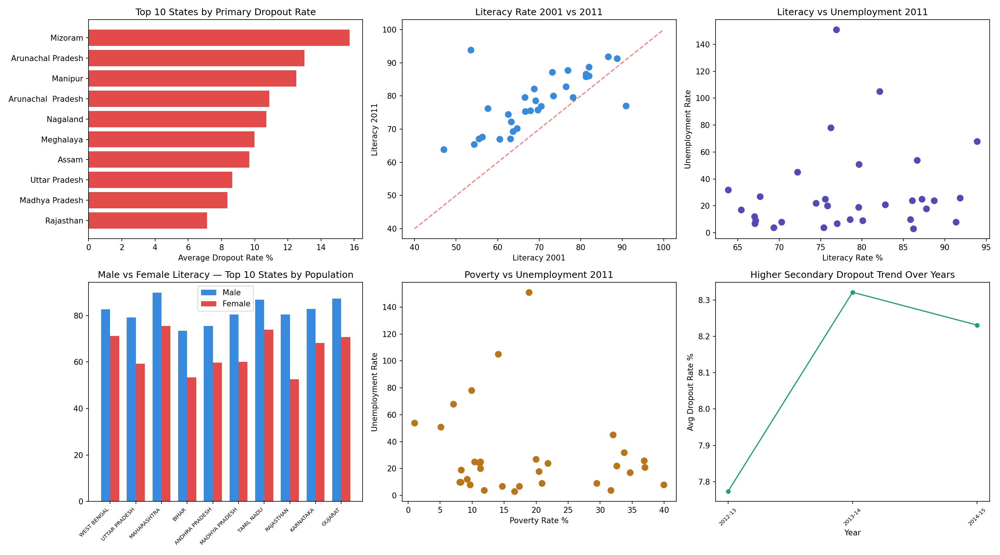
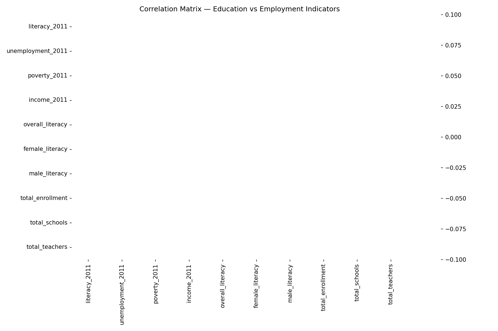
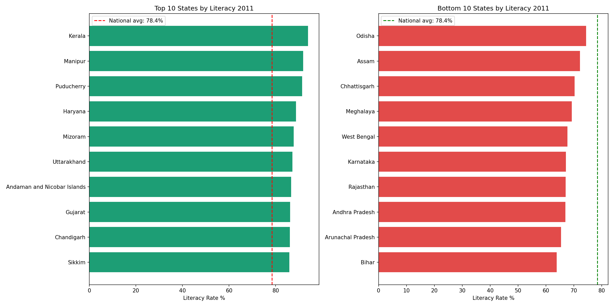

# India Education Employment Gap Analysis

## Problem Statement
Analyzed real Indian government education and employment data across 32 states
to identify literacy gaps, dropout crisis patterns, and the literacy-unemployment
paradox where high literacy does not always translate to lower unemployment.

## Tech Stack
- Python — data cleaning, EDA, correlation analysis, state classification
- SQL Server — 3 normalized tables, 8 business queries with window functions
- Power BI — 3-page interactive dashboard

## Datasets
1. State-wise School Dropout Rates — Kaggle (110 rows, 2012-13 to 2014-15)
2. State Indicators — literacy, unemployment, poverty, income (32 rows, 2001 and 2011)
3. Education Stats AISHE — schools, teachers, enrollment (36 rows, reduced from 816 columns)

## Data Quality Work
- Cleaned 'NR' (Not Reported) values and a leaked header value in dropout dataset
  using pd.to_numeric with errors='coerce', then imputed with column median
- Cross-validated literacy_2011 values against Census 2011 official data and
  corrected values for 8 states where Kaggle dataset was inaccurate
  (Kerala, Maharashtra, Bihar, Rajasthan, Mizoram, Tripura, Goa, Himachal Pradesh)
- Reduced education stats dataset from 816 columns to 11 relevant columns

## Key Findings
1. Secondary dropout rate (17.32%) is far higher than Primary dropout (4.70%) —
   critical intervention point is Class 9-10, not primary school
2. Gender literacy gap exists in every state — widest in Rajasthan and UP
3. Literacy-unemployment paradox — Manipur and Puducherry have high literacy
   but also high unemployment, showing education alone is not sufficient
4. Kerala (93.91%) vs Bihar (63.82%) — a 30 percentage point literacy gap
   showing severe regional inequality
5. Goa and Delhi combine high income with above-average literacy, confirming
   economic development and education reinforce each other

## Note on Data Limitations
The dropout trend chart covers only 3 years (2012-13, 2013-14, 2014-15) due
to limited state-level data availability in the source dataset for other years.

## Project Structure
- notebooks/ — data cleaning, EDA and correlation analysis notebook
- sql/ — schema.sql and 8 business analysis queries
- powerbi/ — 3-page dashboard file
- screenshots/ — EDA plots and dashboard pages
- data/ — cleaned datasets

## Business Recommendations
1. Low Literacy High Unemployment states need both schools and local industries
2. High dropout states need mid-day meal schemes and conditional cash transfers
   targeted specifically at secondary school retention
3. Gender gap states need targeted girl education programs
4. High student-teacher ratio states need urgent teacher recruitment drives

## Dashboard Screenshots

### Page 1 — Executive Overview

### Page 2 — Dropout Analysis

### Page 3 — Education vs Employment

## EDA Plots

### Full EDA Overview

### Correlation Matrix

### State Rankings

